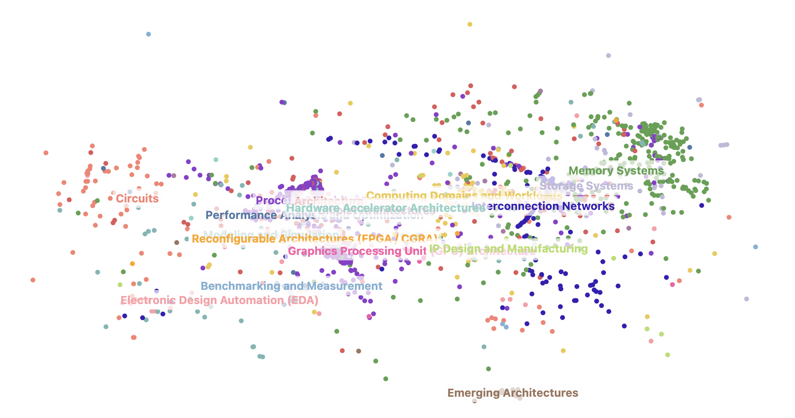
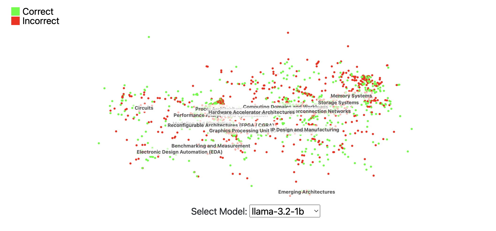

# QuArch

**QuArch** stands for **Qu**estion **A**nswering in Computer **Arch**itecture. It is a specialized dataset designed to support AI-driven question answering in the domain of computer architecture and hardware.

---

## **What is QuArch?**
**QuArch** (Question Answering in Computer Architecture) is a specialized dataset designed to support AI-driven question answering in the domain of computer architecture and hardware. Built from the Archipedia corpus—a comprehensive collection of research articles, technical papers, and insights spanning decades—QuArch consists of questions on a wide range of computer architecture topics, with answers derived from curated technical content.

**QuArch** provides structured datasets for both straightforward and complex questions in areas such as:
- **Processor Design**
- **Memory Systems**
- **Performance Optimization**

By tackling these technical topics, QuArch serves as a benchmark dataset, helping researchers build and evaluate AI models for accuracy and relevance in the computer architecture domain.

The **alpha release of QuArch v1.0** offers a foundation of question-answer pairs, designed to help advance natural language understanding in technical fields and bridge the gap between AI capabilities and specialized knowledge in computer hardware and architecture.

For more details about QuArch, refer to the following paper:

> 📘 **[Architecture 2.0](https://www.sigarch.org/architecture-2-0-why-computer-architects-need-a-data-centric-ai-gymnasium/)**

---

## **Resources**
Explore the QuArch project through the following links:
- 🔗 **[Hugging Face](https://huggingface.co/Harvard-Edge)**
- 📄 **[Archipedia Paper](https://example.com/archipedia-paper)**

---

## **Model Leaderboard**
The leaderboard tracks the performance of AI models in QuArch. It assesses domain knowledge in computer architecture, supporting the development of AI agents that can reason about system problems, trade-offs, and optimizations.

| **Rank** | **Model**      | **Affiliation** | **Accuracy (%)** | **Date**         |
|---------|-----------------|-----------------|-------------------|-------------------|
| 🥇 1     | Claude-3.5     | Anthropic       | 83.76%            | October 15, 2024  |
| 🥈 2     | GPT-4o         | OpenAI          | 83.38%            | October 2, 2024   |
| 🥉 3     | LLaMA-3.1-70B  | Meta            | 78.72%            | October 2, 2024   |
| 4       | Gemini-1.5      | Google          | 78.07%            | October 15, 2024  |
| 5       | LLaMA-3.1-8B   | Meta            | 71.73%            | October 1, 2024   |
| 6       | LLaMA-3.2-3B   | Meta            | 59.51%            | October 15, 2024  |
| 7       | Gemma-2-27B    | Google          | 60.35%            | October 15, 2024  |
| 8       | Mistral-7B     | Mistral AI      | 61.97%            | October 1, 2024   |
| 9       | LLaMA-3.2-1B   | Meta            | 48.77%            | October 1, 2024   |
| 10      | Gemma-2-9B     | Google          | 47.93%            | October 1, 2024   |
| 11      | Gemma-2-2B     | Google          | 38.62%            | October 1, 2024   |

---

## **QuArch Embeddings**
QuArch provides a visualization of embeddings, which plot how questions and answers relate to one another. The dataset includes **total question distributions** as well as **correctness across models**. You can toggle between these two views using the buttons below.

### **📊 Total Question Distribution**
Plots all questions from the dataset.

---

### **✅ Correctness Across Models**
Highlights the correctness of each model's performance. The following image is an example of **llama-3.2-1b**'s performance.

---

## **Navigation**
**QuArch** includes a fully interactive interface. The navigation bar includes links to the following pages:
- **Home**: View the main page for QuArch.
- **Contact**: Reach out to the team.

---

## **Footer**
The footer includes a link to the QuArch GitHub repository. If you'd like to contribute or explore the source code, check it out here:

---

## **Copyright**
All rights reserved. Copyright © Harvard University, 2024.
